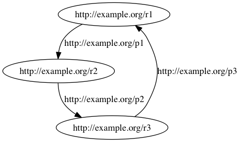
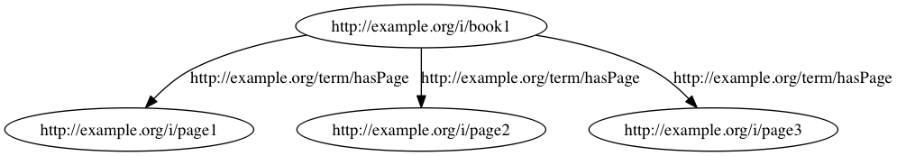

# JSON-LD Framing

IIIF documents are all JSON-LD but they have very tightly specified formats so that a developer can think of them as straightforward JSON documents with a particular structure. But since JSON-LD is a form of RDF this begs the question of how to get from an RDF graph to an IIIF-compatible JSON-LD document. Enter "framing":

> _"A JSON-LD document is a representation of a directed graph. A single directed graph can have many different serializations, each expressing exactly the same information. Developers typically work with trees, represented as JSON objects. While mapping a graph to a tree can be done, the layout of the end result must be specified in advance. A Frame can be used by a developer on a JSON-LD document to specify a deterministic layout for a graph."_ \[<http://json-ld.org/spec/latest/json-ld-framing/#introduction>\]

JSON-LD framing is a **W3C Draft Community Group Report 04 October 2016**

> _"It is not a W3C Standard nor is it on the W3C Standards Track."_ \[<http://json-ld.org/spec/latest/json-ld-framing/>\]

There is new activity on framing started in [August 2016](https://lists.w3.org/Archives/Public/public-linked-json/2016Sep/0010.html) with the intention of moving work into an RDF WG. [Current issues](https://github.com/json-ld/json-ld.org/issues?q=is%3Aissue+is%3Aopen+label%3Aframing) are stored as issues on github.

## Framing example 1 - a cycle with "duck" typing

Let's consider a simple RDF graph with three resources connected in a cycle by diferent predicates:



The example program:

``` shell
jsonld-framing> python cycle0.py 
```

includes a **JSON-LD frame** `{"http://example.org/p1": {}}` which says that the serialization should be rooted at resources that have triples with predicate `http://example.org/p1`. The output is:

``` json
{
  "@graph": [
    {
      "@id": "http://example.org/r1",
      "http://example.org/p1": {
        "@id": "http://example.org/r2",
        "http://example.org/p2": {
          "@id": "http://example.org/r3",
          "http://example.org/p3": {
            "@id": "http://example.org/r1"
          }
        }
      }
    }
  ]
}
```

where the key Python snippet is:

``` python
framed = jsonld.frame(doc, frame)
```

Unfortunately, the framing algorithm introduces an enclosing `@graph` structure and to remove that while avoiding ad-hoc methods we can compact the graph. The code `cycle1.py` changes the snippet as follows:

``` sh
jsonld-framing>diff cycle0.py cycle1.py
17c17
< framed = jsonld.frame(doc, frame)
---
> framed = jsonld.compact(jsonld.frame(doc, frame),{})
```

and then running

``` shell
jsonld-framing> python cycle1.py
```

produces:

``` json
{
  "http://example.org/p1": {
    "http://example.org/p2": {
      "@id": "http://example.org/r3",
      "http://example.org/p3": {
        "@id": "http://example.org/r1"
      }
    },
    "@id": "http://example.org/r2"
  },
  "@id": "http://example.org/r1"
}
```

``` shell
jsonld-framing> python cycle2.py http://example.org/p2
```

produces:

``` json
{
  "http://example.org/p2": {
    "http://example.org/p3": {
      "http://example.org/p1": {
        "@id": "http://example.org/r2"
      },
      "@id": "http://example.org/r1"
    },
    "@id": "http://example.org/r3"
  },
  "@id": "http://example.org/r2"
}
```

``` shell
jsonld-framing> python cycle2.py http://example.org/p3
```

produces:

``` json
{
  "@id": "http://example.org/r3",
  "http://example.org/p3": {
    "@id": "http://example.org/r1",
    "http://example.org/p1": {
      "@id": "http://example.org/r2",
      "http://example.org/p2": {
        "@id": "http://example.org/r3"
      }
    }
  }
}
```

If we attempt to frame starting at a resource or resources that are the subject of triples with a non-existant predicate, then the output JSON is empty:

``` shell
jsonld-framing> python cycle2.py http://example.org/not-present
```

produces:

``` json
{}
```

## Framing example 2 - book and pages with explicit typing

Consider a second example, a book with three pages:



The example code `book_framed.py` take the frame as a command line argument and thus the command:

``` shell
jsonld-framing> python book_framed.py '{"@type": "http://example.org/term/Book"}'
```

selects the one resource of type `Book` as the root node:

``` json
{
  "@id": "http://example.org/i/book1",
  "@type": "http://example.org/term/Book",
  "http://example.org/term/hasPage": [
    {
      "@id": "http://example.org/i/page1",
      "@type": "http://example.org/term/Page",
      "http://purl.org/dc/elements/1.1/title": "First page"
    },
    {
      "@id": "http://example.org/i/page2",
      "@type": "http://example.org/term/Page",
      "http://purl.org/dc/elements/1.1/title": "Middle page"
    },
    {
      "@id": "http://example.org/i/page3",
      "@type": "http://example.org/term/Page",
      "http://purl.org/dc/elements/1.1/title": "Last page"
    }
  ],
  "http://purl.org/dc/elements/1.1/title": "A story"
}
```

However, we might write the code to look instead for resources of type `Page`:

``` shell
jsonld-framing> python book_framed.py '{"@type": "http://example.org/term/Page"}'
```

produces:

``` json
{
  "@graph": [
    {
      "@id": "http://example.org/i/page1",
      "@type": "http://example.org/term/Page",
      "http://purl.org/dc/elements/1.1/title": "First page"
    },
    {
      "@id": "http://example.org/i/page2",
      "@type": "http://example.org/term/Page",
      "http://purl.org/dc/elements/1.1/title": "Middle page"
    },
    {
      "@id": "http://example.org/i/page3",
      "@type": "http://example.org/term/Page",
      "http://purl.org/dc/elements/1.1/title": "Last page"
    }
  ]
}
```

FIXME:

  * difference of 1 instance vs 2 with {} and \[]

## References

"Framing explanation and framing return values", Dave Longley, <https://lists.w3.org/Archives/Public/public-linked-json/2011Aug/0078.html>

"JSON-LD Framing 1.1: An Application Programming Interface for the JSON-LD Syntax. Draft Community Group Report 04 October 2016" <http://json-ld.org/spec/latest/json-ld-framing/> -- avoid reading this if possible, it is impeneterable.


